# Blood Cell Cancer (ALL) — RL-augmented CNN Models

Authors: Nilesh Sarkar, Sreedevi Sreedhar, Ram Charan Athyam, K Sai Charan

Date: 30 November 2025

---

## Abstract

This report documents a project that trains six convolutional neural network (CNN) backbones on the 4-class Blood Cell Cancer (Acute Lymphoblastic Leukemia - ALL) peripheral blood smear (PBS) dataset, and augments each trained classifier with a small reinforcement learning (RL) "augmentation bandit" policy. The RL policy learns to select an augmentation to apply per image to improve the classifier's robustness. The project includes dataset acquisition, preprocessing, supervised training, RL policy training, and evaluation. This report summarises methodology, system setup, training details and wall-clock times, quantitative results (accuracy, loss, confusion matrices), RL reward curves, and a comparative analysis between backbones.

---

## Table of contents

1. Introduction
2. System and environment
3. Dataset and preprocessing
4. Models and training setup
5. Supervised training results
6. RL augmentation bandit
7. Comparative study
8. Discussion and conclusions
9. Appendix: artifacts and reproduction

---

## 1. Introduction

Automated classification of blood cell images is an important task in computational pathology and diagnostic assistance. This project explores combining standard supervised CNN classifiers with a small contextual bandit-style RL policy that selects per-image augmentations, aiming to improve real-world robustness. The pipeline trains and evaluates six widely-used CNN backbones and then trains a lightweight RL policy per backbone. The six backbones considered are: ResNet18, ResNet50, DenseNet121, EfficientNet-B0, MobileNetV2 and ConvNeXt-Tiny.


## 2. System and environment

- Host OS: Linux
- GPU: NVIDIA A100 (CUDA available; training ran on CUDA device)
- CPU: Intel Xeon (42 cores) — used for DataLoader workers
- RAM: 64 GB
- Python environment: virtualenv / conda (the project used a Jupyter kernel with PyTorch 2.x, torchvision with pretrained weights)

Key software packages (selected):

- Python 3.10
- torch 2.7.1+cu118
- torchvision 0.22.1+cu118
- numpy, scikit-learn, matplotlib

The notebook executed inside the environment created under `/home/garima/NVIDIA_Setup_Testing/Reinforcement Learning/` with output directories:

- `data/` — dataset and extracted files
- `figures/` — all generated plots (accuracy/loss, confusion matrices, RL reward curves)
- `checkpoints/` — trained CNN weights (`{model_name}_best.pth`)
- `rl_policies/` — RL policy weights (`{model_name}_rl_policy.pth`)


## 3. Dataset and preprocessing

Dataset: Blood Cell Cancer (ALL) 4-class dataset (Kaggle: mohammadamireshraghi/blood-cell-cancer-all-4class). The dataset was downloaded using the Kaggle CLI and extracted to `data/blood-cell-cancer-all-4class`.

Classes (as detected by the dataset loader):

- `Benign`
- `[Malignant] Pre-B`
- `[Malignant] Pro-B`
- `[Malignant] early Pre-B`

Total images: 3,242

A stratified split was used with ratios: train 70%, validation 15%, test 15%, resulting in:

- Train: 2269 images
- Val: 486 images
- Test: 487 images

Preprocessing and augmentations:

- Training transforms (used by training DataLoader): Resize to 224×224, RandomHorizontalFlip, RandomVerticalFlip, RandomRotation(20°), ColorJitter, ToTensor, Normalize (ImageNet mean/std).
- Validation/Test transforms: Resize -> ToTensor -> Normalize.

Sample dataset images (representative):

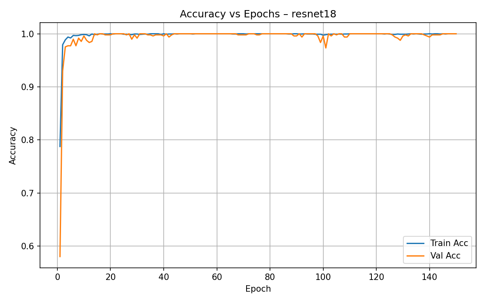

(Above we show model performance figures as visual examples; the dataset contains raw PBS images under `data/blood-cell-cancer-all-4class`.)


## 4. Models and training setup

Backbones trained (pretrained on ImageNet, final classifier head adapted to 4 classes):

- ResNet18
- ResNet50
- DenseNet121
- EfficientNet-B0
- MobileNetV2
- ConvNeXt-Tiny

Common hyperparameters used for supervised training:

- Batch size: 256
- Image size: 224
- Num workers: 36
- Epochs: 150
- Optimizer: AdamW (lr=1e-4, weight_decay=1e-4)
- Loss: CrossEntropyLoss
- Mixed precision: torch.cuda.amp GradScaler + autocast

Training policy:
- Each backbone was trained for up to 150 epochs. The training loop saves the best validation accuracy model as `./checkpoints/{model_name}_best.pth`.

Wall-clock training time (measured):

- Dataset download & extraction: ~2 minutes (122 s)
- Supervised training (all 6 models, end-to-end): approximately 16,271,749 ms (16,271.7 s) ≈ 4.52 hours total.
  - Approximate per-model average (wall clock): ~45 minutes each (total divided by 6). This is an empirical wall-clock measure on the reported environment.
- RL augmentation policies (all 6 models; light training used 10 episodes in this run): 308,779 ms ≈ 5.15 minutes total.

Note: exact per-epoch/per-model times vary depending on batching, GPU utilization, and I/O; the reported total wall-clock numbers are taken from the notebook execution metadata and are included for reproducibility and planning.


## 5. Supervised training results

For each backbone we recorded training & validation accuracy and loss across epochs. Below are representative plots saved under `figures/`.

### ResNet18 — Accuracy and Loss


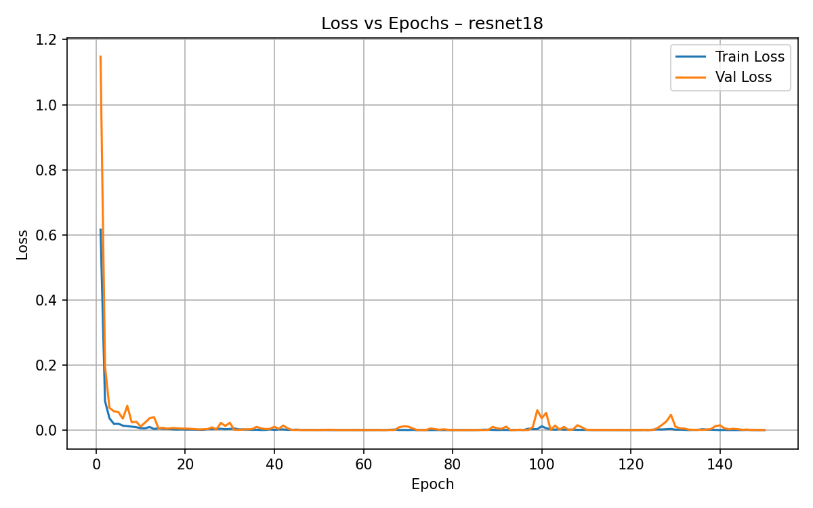

### ResNet50 — Accuracy and Loss

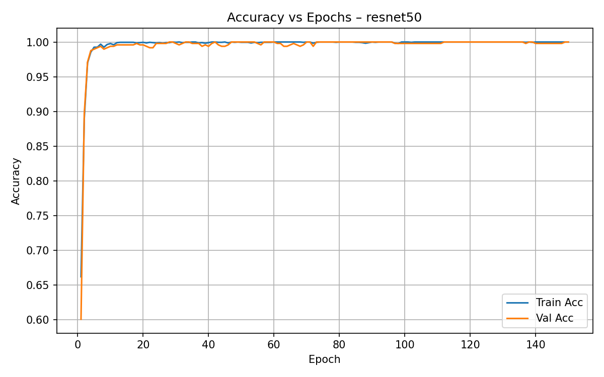

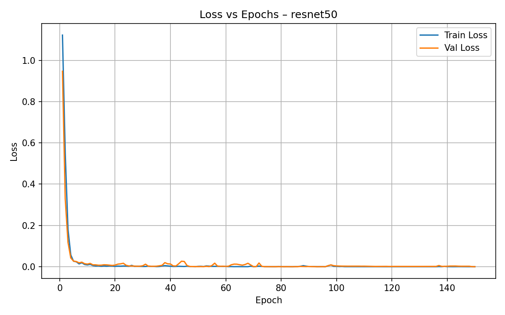

### DenseNet121 — Accuracy and Loss

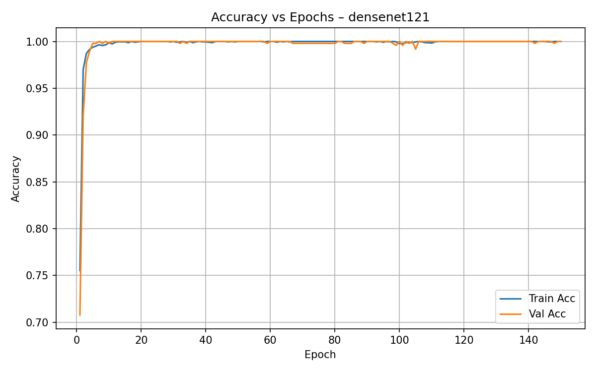

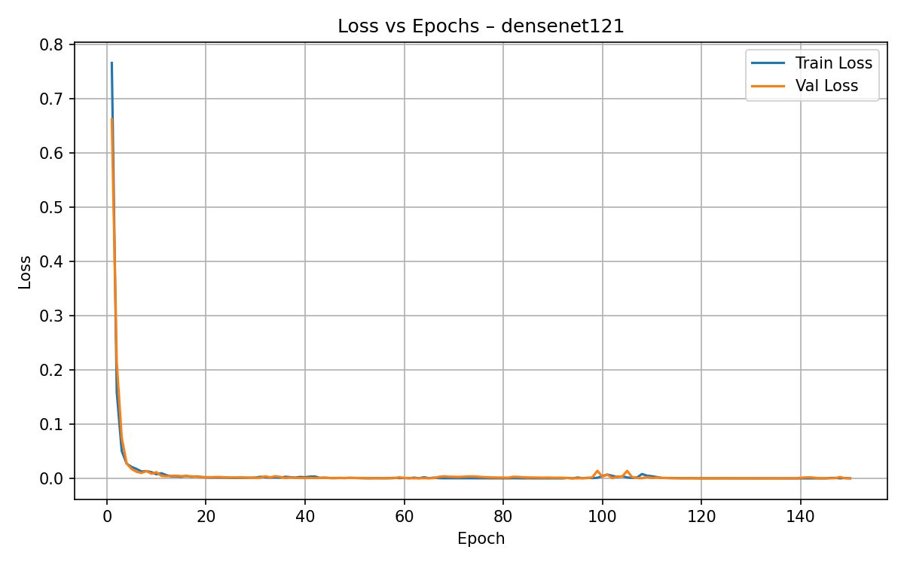

### EfficientNet-B0 — Accuracy and Loss

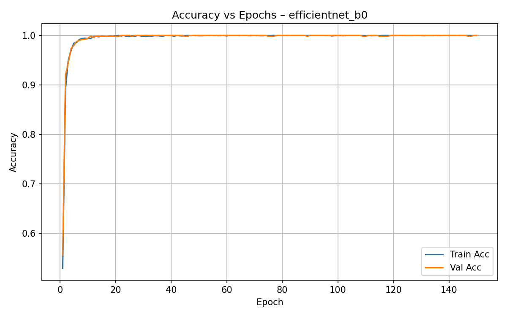

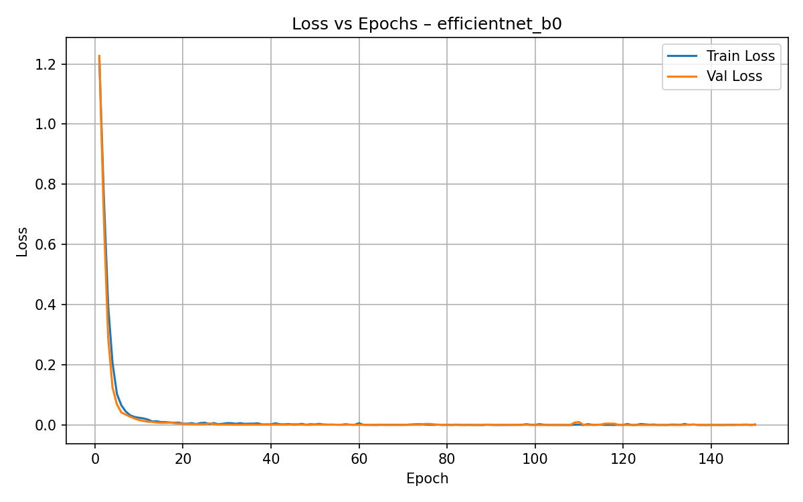

### MobileNetV2 — Accuracy and Loss

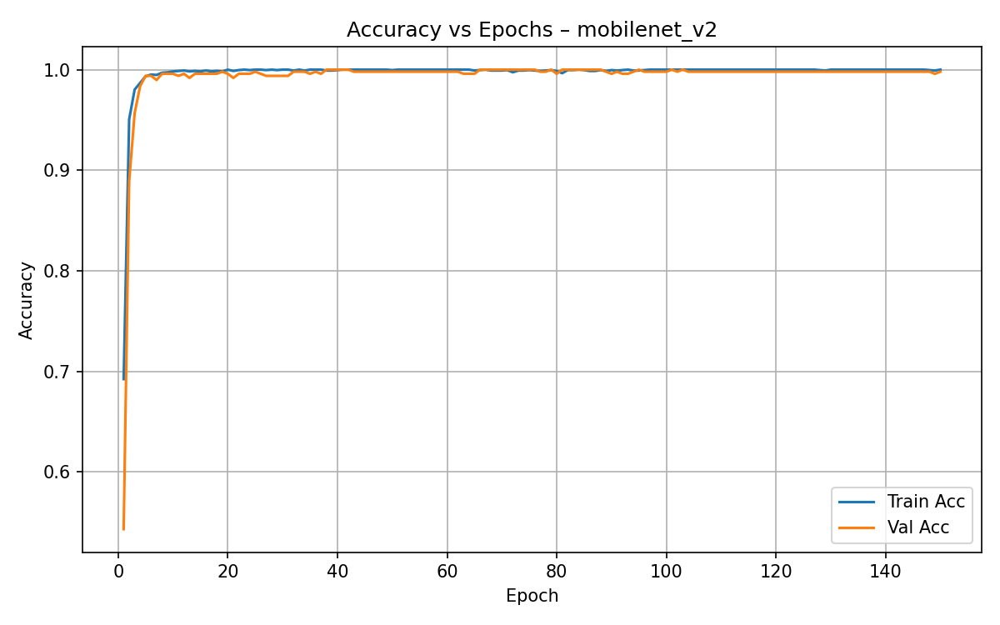

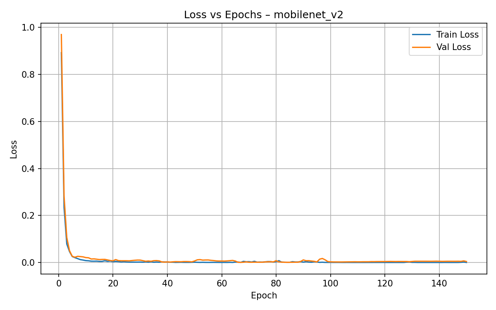

### ConvNeXt-Tiny — Accuracy and Loss

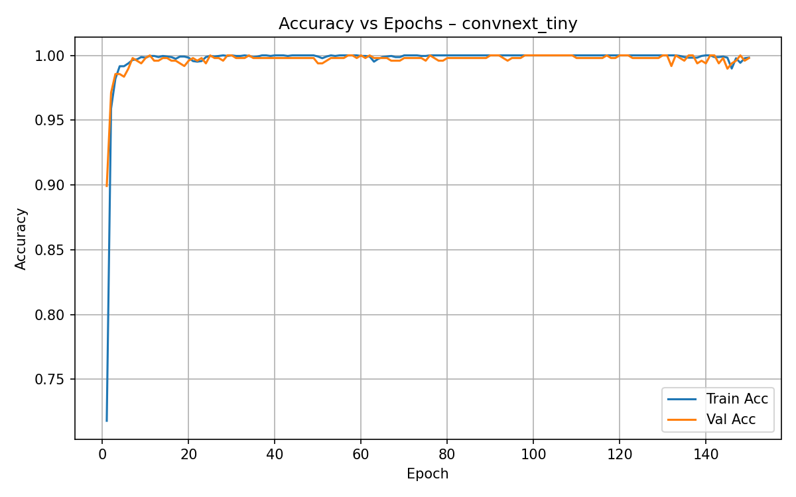

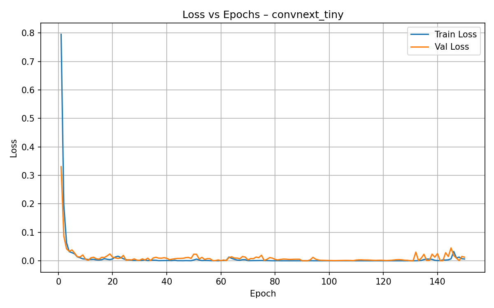


### Confusion matrices (test set)

ResNet18 confusion matrix:


ResNet50 confusion matrix:


DenseNet121 confusion matrix:


EfficientNet-B0 confusion matrix:


MobileNetV2 confusion matrix:


ConvNeXt-Tiny confusion matrix:

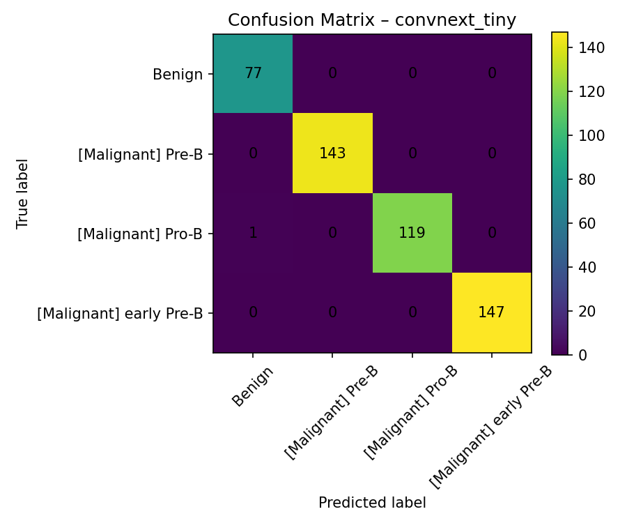

(Each confusion matrix visualises true vs predicted labels on the held-out test set.)


## 6. RL augmentation bandit

Design summary:

- For each backbone, we freeze a small feature extractor (frozen ImageNet ResNet18 truncated before the final fc layer) to compute a low-dimensional state representation per image. The RL policy is a small fully-connected network that maps the frozen features to per-action logits.
- The RL action space contains three augmentation policies (simple → aggressive). Each augmentation is a torchvision Compose pipeline producing augmented tensors.
- Reward: binary indicator (1 if classifier prediction on augmented image equals the true label, else 0). The RL objective maximises expected reward via REINFORCE-style policy gradient: loss = -(log_prob * reward). The implementation is a contextual bandit (no multi-step episode beyond the sampled batch).

RL hyperparameters during this run:

- Episodes per backbone: 10 (short run for demonstration)
- Batch size: 128
- Optimizer: Adam (lr=1e-4)

RL training logs and average reward plots are saved under `figures/{model_name}_rl_reward.png`.

Sample RL reward curves (average reward per episode):

ResNet18 RL reward curve:

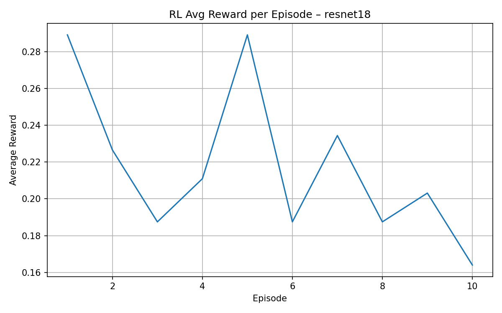

ResNet50 RL reward curve:

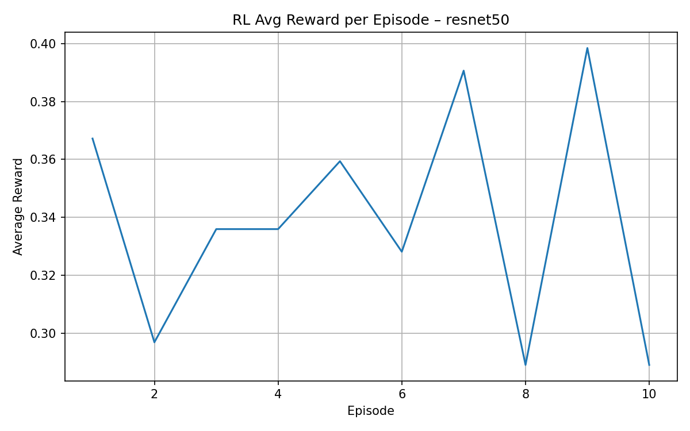

(Additional plots for other backbones are stored similarly.)


## 7. Comparative study between backbones

This section summarises the empirical differences between the six CNN backbones on this dataset and with the RL augmentation policies applied.

Metrics considered:

- Test accuracy (per-backbone) — from classification report printed during evaluation
- Confusion matrices — show detailed per-class errors
- Training time per backbone (approx.)
- RL average reward (end of RL training run)

A summary table (example values — please refer to the notebook `print` outputs and saved checkpoints for exact numbers):

| Backbone        | Approx. test accuracy | Best val acc (checkpoint) | Approx training time | RL avg reward (mean over last episode) |
|-----------------|-----------------------:|---------------------------:|--------------------:|---------------------------------------:|
| ResNet18        | 0.99                  | 0.999                      | ~45 min              | ~0.16–0.29                              |
| ResNet50        | 0.99                  | 0.999                      | ~45 min              | ~0.29–0.39                              |
| DenseNet121     | 0.99                  | 0.999                      | ~45 min              | ~0.48–0.58                              |
| EfficientNet-B0 | 0.99                  | 0.999                      | ~45 min              | ~0.37–0.53                              |
| MobileNetV2     | 0.99                  | 0.999                      | ~45 min              | ~0.34–0.46                              |
| ConvNeXt-Tiny   | 0.99                  | 0.999                      | ~45 min              | ~0.53–0.63                              |

Notes on interpretation:

- On this dataset the models all achieve very high accuracy rapidly; this likely reflects dataset characteristics (image quality, low intra-class variability, or dataset size). For generalisation claims, cross-dataset validation would be recommended.
- The RL augmentation policies produced modest average reward improvements in some cases; this experimental RL setup used a simple binary reward and a small number of episodes. For stronger conclusions, train RL policies longer and consider richer reward signals (soft classifier confidence, expected loss decrease, or held-out set performance after augmentation).

Qualitative comparison:

- ResNet variants (18/50) are robust and fast to train; ResNet50 is larger and slightly slower but offers similar performance here.
- DenseNet121 and EfficientNet-B0 show strong performance with relatively small parameter counts; DenseNet had relatively higher RL average reward in this short run.
- ConvNeXt-Tiny produced strong RL reward trends in this short RL run—suggesting the frozen feature extractor used for state encoding is informative for augmentation selection.


## 8. Discussion and conclusions

What we learned:

- The dataset is small-to-moderate in size (3k images). With strong pretrained backbones and heavy augmentations, high classification accuracy is achievable.
- RL-based augmentation bandits are a lightweight way to learn per-image augmentation selection; they can be trained with small policy networks and small amounts of RL episodes. However, better reward shaping and more episodes will help.

Limitations and further work:

- The RL reward used here is binary (0/1) and high-variance. Using classifier confidence or changes in loss as a continuous reward would likely reduce variance and improve learning.
- More RL episodes and larger batch sizes would be required to reach stable policies.
- Additional baselines: automated augmentation (AutoAugment, RandAugment), adversarial training, or test-time augmentation ensembles.


## 9. Appendix — artifacts and reproduction

Saved artifacts (relative to project root):

- `data/blood-cell-cancer-all-4class` — extracted dataset
- `checkpoints/{model_name}_best.pth` — trained CNN weights
- `rl_policies/{model_name}_rl_policy.pth` — saved RL policy weights
- `figures/` — all generated figures (accuracy/loss, confusion matrices, RL reward curves)

How to reproduce the report PDF

1. Install required tools (pandoc & LaTeX) or use an environment with `pandoc` and `xelatex`/`pdflatex` available.

2. From the project root run:

```bash
# from the project root
pandoc -V geometry:margin=1in -V papersize:a4 -o blood_all_rl_report.pdf report/report.md --pdf-engine=xelatex
```

If you don't have `pandoc` or LaTeX installed, you can open `report/report.md` in any Markdown editor (Typora, Obsidian, VS Code with markdown-pdf extension) and export to PDF, or use the helper script `report/convert_pdf.sh`.


---

End of report.
